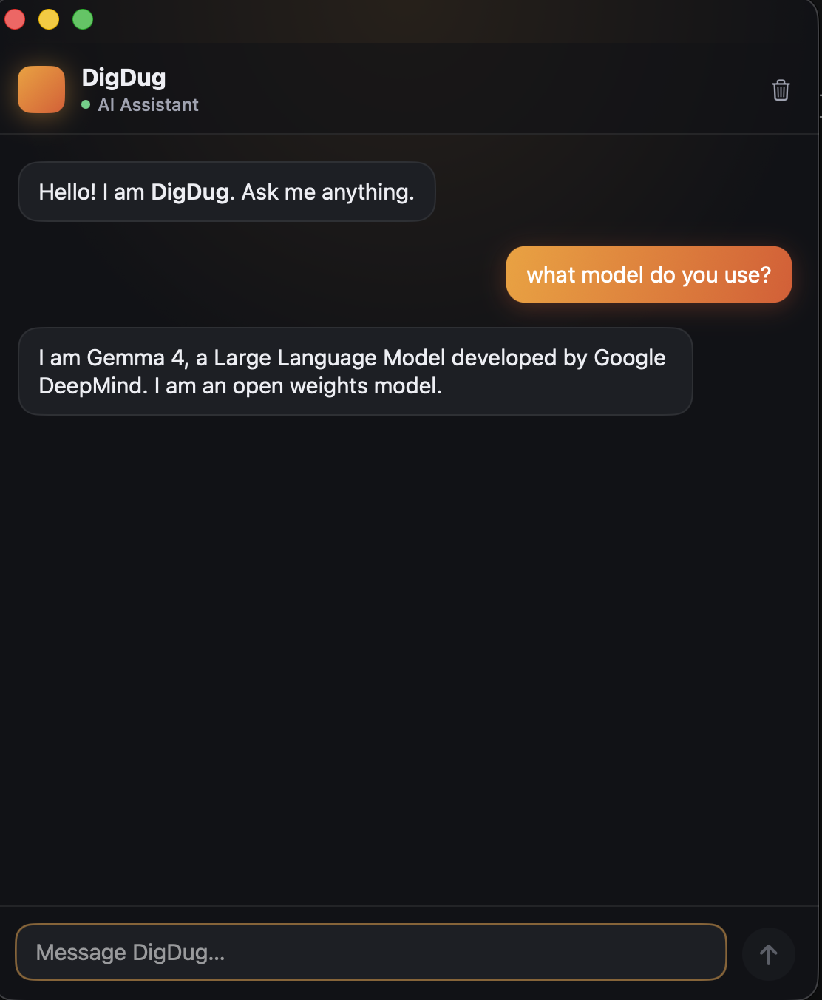
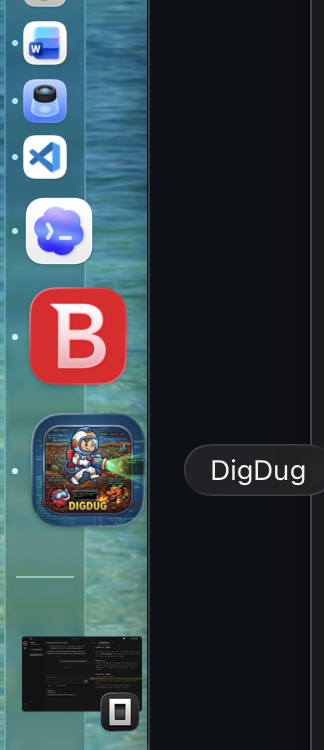

# DigDug

<p align="center">
  
</p>

A lightweight, always-on-top macOS chat panel that talks to a **local Ollama** model. Summon it over any app, ask a question, read a markdown/code answer, copy, dismiss. No cloud, no telemetry — inference stays on your machine.

Built with Swift 6 / SwiftUI + AppKit (`NSPanel`). Markdown rendered via `swift-markdown-ui`.

## Screenshots

<p align="center">
  
</p>

<p align="center">
  
  <br>
  <em>Floating chat panel (left); lives in the Dock and menu bar (right).</em>
</p>

## Requirements
- macOS 13+
- Swift toolchain (Command Line Tools is enough — full Xcode not required)
- [Ollama](https://ollama.com) running locally with the model pulled:
  ```sh
  ollama pull gemma4:e4b
  ollama serve   # or the menu-bar app; listens on http://localhost:11434
  ```

## Run
```sh
swift run DigDug                 # launch the panel directly
# or build a double-clickable app:
bash scripts/make_app.sh         # → build/DigDug.app
bash scripts/make_app.sh --install   # also copies to /Applications
```

## Test
```sh
swift run DigDugTestRunner       # ✅ runs swift-testing for real
# swift test                     # ❌ silently skips under CLT-only — do not use
```
Why: Command Line Tools has no `xctest` host, so `swift test` exits 0 without running. The `DigDugTestRunner` executable calls the swift-testing entry point directly. See `learnings.md`.

## Layout
| Path | Purpose |
|---|---|
| `Sources/DigDugCore/` | Model + `OllamaService` (streaming HTTP client) |
| `Sources/DigDugApp/` | App lifecycle, floating panel, SwiftUI views, `Theme.swift` tokens |
| `scripts/` | `make_app.sh`, icon generation |
| `Tests/` | swift-testing suites + `Runner.swift` |
| `docs/` | spec, decisions, validation, reference index |

## AI operating surface
This repo is set up for agentic development (per *Elite AI-Assisted Coding*):

| Surface | File / location |
|---|---|
| Rules (always-on) | [`AGENTS.md`](./AGENTS.md) — canonical; [`CLAUDE.md`](./CLAUDE.md) defers to it |
| Spec (the contract) | [`docs/spec.md`](./docs/spec.md) |
| Design intent | [`PRODUCT.md`](./PRODUCT.md) |
| Decisions (ADR) | [`docs/decisions.md`](./docs/decisions.md) |
| Validation | [`docs/validation.md`](./docs/validation.md) |
| Reference index | [`docs/reference-index.md`](./docs/reference-index.md) |
| Live work state | `plan.md`, `progress.md`, `TASKS.md` |
| Learnings / traps | [`learnings.md`](./learnings.md) |
| Skills | `.agents/skills/` (`setup-and-run`, `digdug-domain-reference`, `impeccable`) |
| MCP | `opencode.json` → `fetch` server (runtime HTTP / doc access) |

Tool used: [opencode](https://opencode.ai) with a local Ollama coding model, and Claude Code.

## Acknowledgments
The agentic operating surface in this repo (rules, spec, skills, MCP, living docs) was inspired by **Eleanor Berger**'s *Elite AI-Assisted Coding* course. The structure here is my own application of those ideas; the course material itself is not included.
